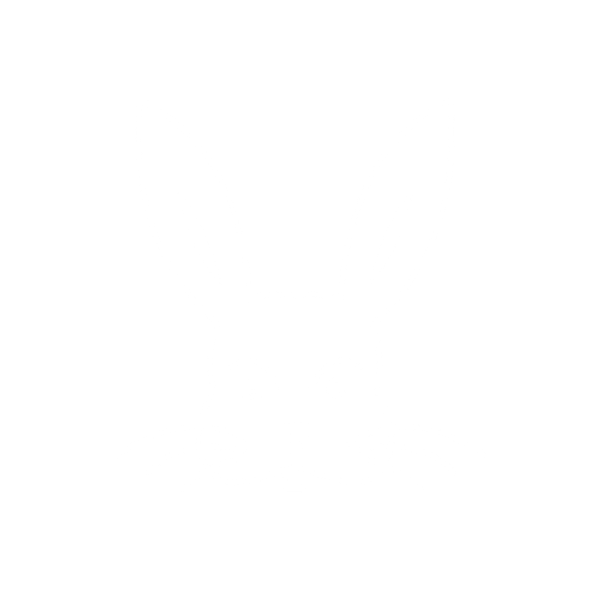

 

  
  <!-- Contacts tags -->

&#8287;&#8287;&#8287;&#8287;&#8287;
&#8287;&#8287;&#8287;&#8287;&#8287;

&#8287;&#8287;&#8287;&#8287;&#8287;

&#8287;&#8287;&#8287;&#8287;&#8287;

<h3 align="center"> &#8287; <b> About me </b> </h3>

<ul>
  <li>😺 My name is Jonatas Sennas a.k.a. Jon</li>
  <li>👦🏾 I'm a tireless self-taught, undergraduated Pharmacy student and coding is my passion since the beginning of 2022</li>
  <li>💻 I'm a student of <a href="https://www.driven.com.br/">Driven Education</a>.</li>
  <li>🌱 I’m currently learning React.</li>
  <li>🎉 Fun fact: I was a teacher's assistant in college twice. First in organic chemistry and second in pharmacology</li>
 </ul>
 
       
 

<!-- Hard skills -->
  <h2><b>  Hard Skills</b></h2>
<ul>
  <li>
    <h3>Front-End Development</h3>
    &#8287;&#8287;
    &#8287;&#8287;
    &#8287;&#8287;
    &#8287;&#8287;
    &#8287;&#8287;
  </li>
  <li>
    <h3>Software ans tools</h3>
    &#8287;&#8287;
    &#8287;&#8287;
    &#8287;&#8287;
    &#8287;&#8287;
    
  </li>
  <li>
    <h3>Extras</h3>
    &#8287;&#8287;
  </li>
  <li>
   <h3>I'm currently learning</h3>
   &#8287;&#8287;
 </li>
 </ul>
 

<!-- People skills -->
  <h2><b>  People Skills</b></h2>
<ul>
  <li><h3>👨‍👧‍👦 Team Work</h3></li>
  <li><h3>🔍 Attention to detail</h3></li>
  <li><h3>⏱ Time management</h3></li>
  <li><h3>❣ Empathy</h3></li>
  <li><h3>🧩 Problem-solving</h3></li>
  <li><h3>🧠 Emotional intelligence</h3></li>
 </ul>
 

 <b>  Git Stats</b>

 
  

<picture>
<source 
  srcset="https://github-readme-stats.vercel.app/api/top-langs/?username=apocsenpai&bg_color=00000000&title_color=008F11&icon_color=008F11&text_color=fafafa"
  media="(prefers-color-scheme: dark)"
/>
<source
  srcset="https://github-readme-stats.vercel.app/api/top-langs/?username=apocsenpai&bg_color=00000000&title_color=003B00&icon_color=008F11&text_color=040404"
  media="(prefers-color-scheme: light), (prefers-color-scheme: no-preference)"
/>

</picture>
    &#8287;&#8287;
    <picture>
<source 
  srcset="https://github-readme-stats.vercel.app/api?username=apocsenpai&show_icons=true&bg_color=00000000&title_color=008F11&icon_color=008F11&text_color=fafafa"
  media="(prefers-color-scheme: dark)"
/>
<source
  srcset="https://github-readme-stats.vercel.app/api?username=apocsenpai&show_icons=true&bg_color=00000000&title_color=003B00&icon_color=008F11&text_color=040404"
  media="(prefers-color-scheme: light), (prefers-color-scheme: no-preference)"
/>

</picture>
  

  <a href="https://github.com/apocsenpai/Projeto_04_parrotsCardGame"/><a>
<a href="https://github.com/jansenosorio/buzzquizz"/><a>
<a href="https://github.com/apocsenpai/BatePapoUol"/><a>
  

 
 <h4 align="right">Knock, knock, visitor.</h4>
 <picture>
<source 
  srcset="./whiteRabbit.png"
  media="(prefers-color-scheme: dark)"
/>
<source
  srcset="./rabbit.png"
  media="(prefers-color-scheme: light), (prefers-color-scheme: no-preference)"
/>
  
</picture>

<!--
Color pallette

Vampire Black - #0D0208
Dark Green - #003B00
Islamic Green - #008F11
Malachite - #00FF41
-->
